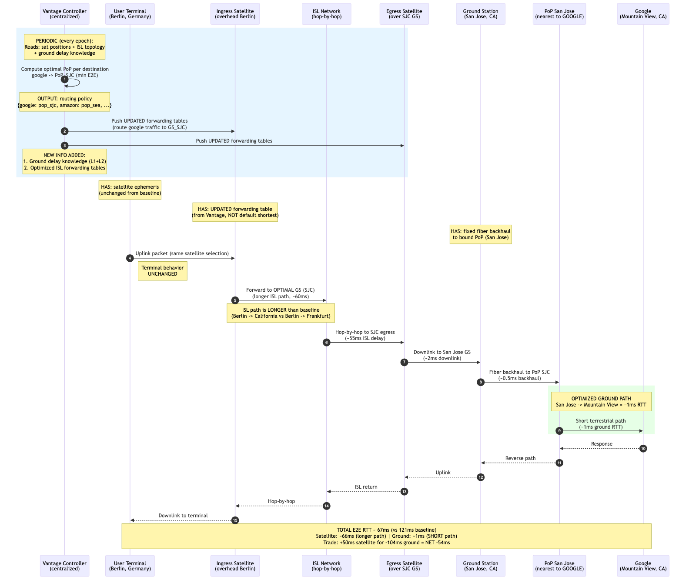
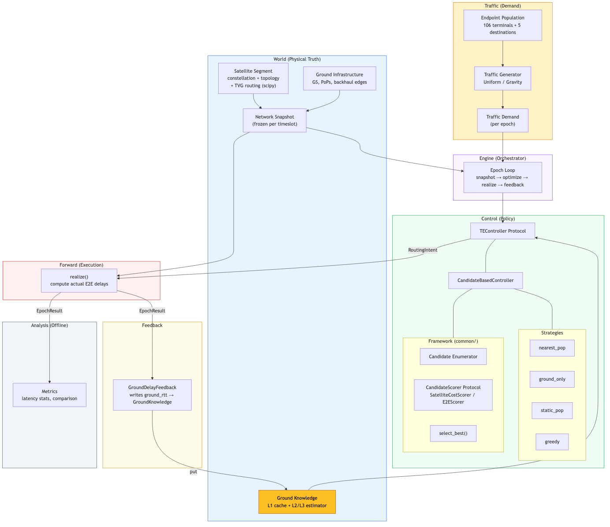

# Vantage

**Ground-aware traffic engineering for LEO satellite networks.**

Satellite ISPs like Starlink optimize ISL (inter-satellite link) routing but ignore ground segment delay. Vantage proves that incorporating ground delay knowledge into PoP selection significantly reduces end-to-end latency.

## Key Idea

Current satellite networks use **hot-potato routing** — traffic exits at the PoP nearest to the user, regardless of destination. This minimizes satellite path length but can result in very long ground paths.

Vantage uses **ground-aware PoP selection** — traffic exits at the PoP nearest to the *destination*, trading longer satellite paths for much shorter ground paths. The net effect is lower total E2E latency.



| Metric | Baseline (Nearest PoP) | Vantage (Greedy) |
|--------|----------------------|-----------------|
| Avg E2E RTT | 121 ms | 67 ms |
| Satellite segment | 16 ms | 66 ms |
| Ground segment | 105 ms | 1 ms |
| **Improvement** | — | **-45%** |

## Architecture

```
for each epoch:
    snapshot = world.snapshot_at(t)              # satellite positions + ISL topology
    demand   = traffic.generate(epoch)           # flow demands (src → dst)
    intent   = controller.optimize(snapshot)     # PoP selection per destination
    result   = forward.realize(intent, snapshot) # compute actual E2E delays
    feedback.observe(result)                     # update ground delay knowledge
```



### Layer Separation

| Layer | Module | Responsibility |
|-------|--------|----------------|
| **World** | `world/` | Satellite positions, ISL topology, routing matrices, ground infrastructure |
| **Policy** | `control/policy/` | PoP selection strategies via candidate enumeration + scoring |
| **Forward** | `forward.py` | Compute actual segment delays along resolved paths |
| **Feedback** | `engine_feedback.py` | Write realized ground delays back to GroundKnowledge |
| **Analysis** | `analysis/` | Offline metrics: latency stats, controller comparison |
| **Domain** | `domain/` | Frozen dataclasses (PathAllocation, FlowKey, NetworkSnapshot, etc.) |

### Controller Strategies

All controllers inherit from `CandidateBasedController` and differ only in PoP selection:

| Strategy | Selection Rule | Use Case |
|----------|---------------|----------|
| `nearest_pop` | PoP closest to user | Baseline (hot-potato) |
| `ground_only` | PoP closest to destination | Oracle (ground-delay optimal) |
| `static_pop` | Best historical PoP per destination | Static lookup |
| `greedy` | Minimize satellite + ground E2E jointly | **Primary algorithm** |

### Ground Knowledge

`GroundKnowledge` is the single source of truth for ground delays:
- **L1 cache**: feedback-derived values (updated each epoch)
- **L2 estimator**: HaversineDelay (distance-based fallback)
- **L3 estimator**: FiberGraphDelay (ITU fiber topology, Dijkstra)

### Performance

Satellite routing uses a **Time-Varying Graph** (TVG):
- Fixed +Grid ISL topology built once
- Edge weights (propagation delays) recomputed per timeslot via vectorized numpy
- All-pairs Dijkstra via scipy sparse (C implementation): **~660ms per timeslot** (12x faster than networkx)
- Results cached per timeslot

## Quick Start

```bash
# Install
uv sync

# Preprocess raw data (run once)
uv run python -m vantage.config.preprocess

# Run experiment
uv run python -m vantage.main

# Run tests
uv run pytest tests/

# Lint + type check
uv run ruff check src/ tests/
uv run mypy src/
```

## Project Structure

```
src/vantage/
    engine/              # Epoch loop orchestrator + RunContext
    domain/              # Frozen dataclasses (pure data models)
    world/
        ground/          # GroundKnowledge, GroundInfrastructure, delay models
        satellite/       # SatelliteSegment, TVG, constellation, routing, visibility
    control/
        controller.py    # TEController Protocol + factory
        policy/
            common/      # CandidateBasedController, candidate, scoring, utils
            nearest_pop.py
            ground_only.py
            static_pop.py
            greedy.py
    forward.py           # Realize intent → compute delays
    engine_feedback.py   # GroundDelayFeedback observer
    traffic/             # EndpointPopulation, generators
    analysis/            # Metrics, controller comparison
    common/              # Physical constants, geo utilities
    config/              # Preprocessed data + preprocess script
```
