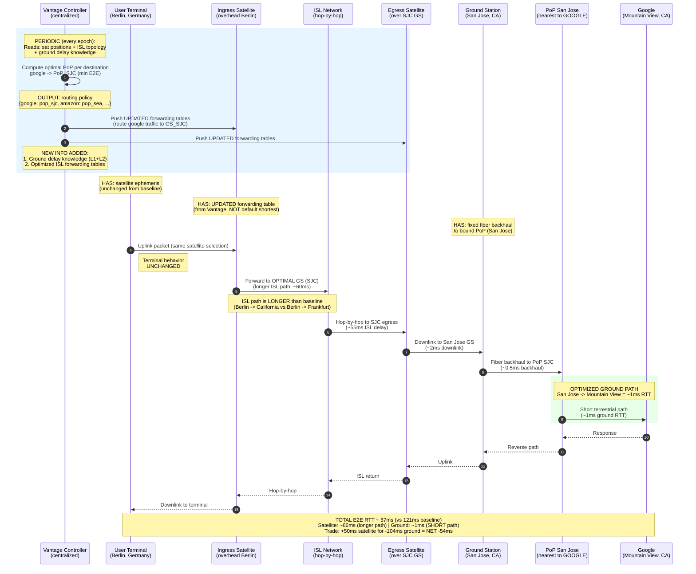

# Vantage: Request to Google (Ground-Aware PoP Selection)

Vantage TE adds ground delay knowledge to the routing decision. Traffic exits at the PoP nearest to the **destination**, trading longer satellite paths for much shorter ground paths.

## What Vantage Adds (Delta from Baseline)

| Node | Baseline Info | Vantage Adds |
|------|-------------|-------------|
| Vantage Controller | (does not exist) | **NEW**: sat positions + ISL topology + ground delay knowledge → routing policy |
| Ingress Satellite | Default forwarding table (nearest GS) | **UPDATED** forwarding table (optimal GS per destination) |
| User Terminal | Ephemeris + antenna data | (unchanged — no terminal modification needed) |
| Ground Station | Fixed backhaul | (unchanged) |
| PoP | BGP table | (unchanged) |

## Key Insight

The **only infrastructure change** is updating satellite forwarding tables. No terminal changes, no GS changes, no PoP changes. Vantage is a **software-only control plane upgrade**.
